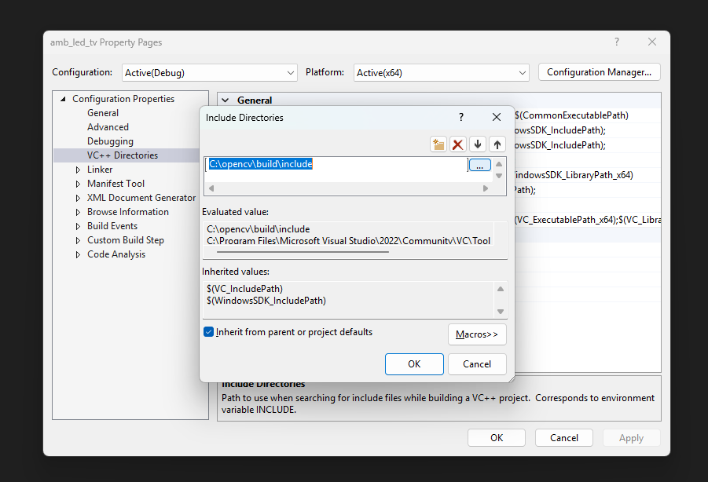
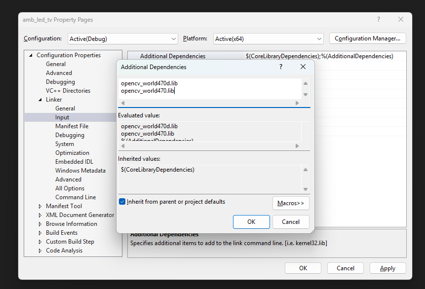

# amb_led_tv_V2

I working again on this project but now i am also finishing it... I want to rewrite all my code so might as well just open a new repo. The other repo is not that important and could be deleted if not needed anymore. This repo will hold the most recent code.

## Real readme

This is meant for the linux (this includes raspberry pi).
Made with OpenCV 4.x

## Installation
This repo includes instalation for linux and windows. 

### Specs
- Installs OpenCV V4.12.0

#### Windows
- Tested with Visual Studio Community 2022 (64-bit) V17.14.15.

### Windows
Follow the steps down below to setup OpenCV for windows in a Visual Studio C++ project. This way you can compile the code with Visual Studio.

#### Installing OpenCV
1. Run OpenCV installation batch script in the Install folder. This will download the OpenCV V4.12.0 self extracting archieve and run it. This has the OpenCV library pre-buildt. It will extract directly into the C:\opencv folder. This is recommended by OpenCV. (https://docs.opencv.org/4.x/d3/d52/tutorial_windows_install.html at "Building the library", step 5) 

#### Linking OpenCV directories to project
2. Create a new (empty) C++ project with Visual Studio if you havent already.
3. Navigate to Project -> Properties -> (Under: Configuration Properties) VC++ Directories -> Include Directories -> click on the ▼ button -> <Edit...> -> click the folder icon -> click the (...)
4. Now add the path C:\opencv\build\include and press OK.

5. Now we will add the Library Directory. In the same list navigate to Library Directories -> click on the ▼ button -> <Edit...> -> Click the folder icon -> click the (...)
6. Add the following paths:
- C:\opencv\build\x64\vc16\lib 

7. Press OK.

8. Next we will add the linker. For that navigate in the left sidebar to Linker -> Input -> Additional Dependencies -> click on the ▼ button -> <Edit...>
9. Add the following linkers by pasting them in:
- opencv_world4120d.lib (Used for debugging)
- opencv_world4120.lib (Used for release)

10. Click on OK and CLICK ON APPLY!!!! (right corner)

#### Adding environment variables
We are almost there, keep going!

11. Add the following paths to your Path environment variables:
- C:\opencv\build\x64\vc16\lib
- C:\opencv\build\x64\vc16\bin

And now you are done! You can run the test_code.cpp to see if it works.
If it doesnt work please restart Visual Studio or your PC. 